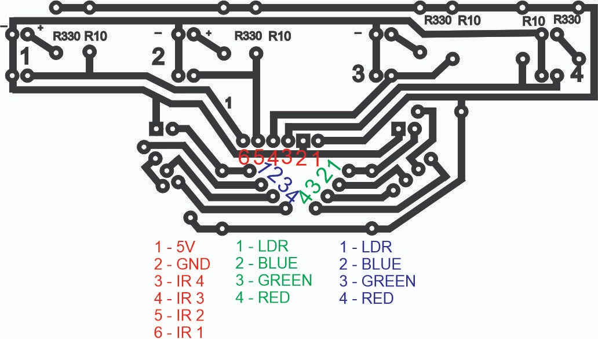

# Material de Suporte

Esse material vai ajudá-los a entender os componentes utilizados no hardware, a programação do software no arduino e o que precisa ser desenvolvido para competir.

## Sumário
- [Hardware](#hardware)
    - [1. Arduino Mega 2560](#1-arduino-mega-2560)
        - [1.1 POWER](#11-power)
        - [1.2 ANALOG IN](#12-analog-in)
        - [1.3 DIGITAL](#13-digital)
        - [1.4 PWM](#14-pwm)
        - [1.5 COMMUNICATION](#15-communication)
    - [2. Placa de sensores](#2-placa-de-sensores)
        - [2.1 POWER](#21-power)
        - [2.2 Sensores Infravermelho](#22-sensores-infravermelho)
        - [2.3 Sensores LDR](#23-sensores-ldr)
        - [2.4 LEDs](#24-leds)
    - [3. Sensores ultrassônicos](#3-sensores-ultrassônicos)
        - [3.1 POWER](#31-power)
        - [3.2 ECHO](#32-echo)
        - [3.3 TRIG](#33-trig)
    - [4. Pontes H](#4-pontes-h)
        - [4.1 POWER](#41-power)
        - [4.2 Saídas A e B](#42-saídas-a-e-b)
        - [4.3 Habilita A e B](#43-habilita-a-e-b)
        - [4.4 Entrada](#44-entrada)
        - [4.5 Habilita 5V](#45-habilita-5v)
    - [5. Jumpers](#5-jumpers)
- [Software](#software)
- [A Competição](#3-a-competição)

## Hardware

### 1. Arduino Mega 2560

Esse é o cérebro do nosso robô, toda a programação que fazemos para controlar os outros componentes é compilada nele e interpretada. Ele é composto de portas digitais, analógicas, de alimentação e outras funções.

### 1.1 POWER

- IOREF ( ***NÃO UTILIZAMOS*** ) 

Em resumo, o pino IOREF é apenas uma saída de leitura para que os shields saibam com qual nível de tensão lógica (5V ou 3.3V) o Arduino está trabalhando, garantindo maior segurança e universalidade no ecossistema Arduino. Você não deve usá-lo para alimentar componentes pesados, apenas como referência de sinal.

- RESET ( ***NÃO UTILIZAMOS*** )

A porta RESET do Arduino Mega 2560 serve para reiniciar o microcontrolador, fazendo com que o programa enviado para a placa comece a ser executado novamente do absoluto zero.

- 3.3V ( ***NÃO UTILIZAMOS ATÉ O MOMENTO*** )

A porta (ou pino) 3.3V do Arduino Mega 2560 é um pino de saída de alimentação. A função dele é fornecer energia elétrica regulada nessa voltagem específica para alimentar componentes externos.

- 5V

A porta (ou pino) 5V é a principal fonte de alimentação de saída para circuitos externos no Arduino Mega 2560. Como o microcontrolador da placa (ATmega2560) opera nativamente em 5V, esta é a tensão padrão para a esmagadora maioria dos componentes clássicos do ecossistema Arduino.

- GND

A porta (ou pino) GND significa "Ground" (que se traduz como Terra ou Massa em eletrônica).

O Arduino Mega possui 5 pinos GND espalhados pela placa, e todos eles estão conectados internamente entre si.

- VIN

A porta (ou pino) VIN significa "Voltage In" (Entrada de Tensão). Ela é uma das portas mais versáteis do Arduino Mega 2560, pois serve tanto como uma entrada para alimentar a placa quanto como uma saída de energia bruta.

### 1.2 ANALOG IN

As portas do intervalo A0 até A15 (Totalizando 16 pinos) são chamadas de analógicas. Diferente das portas digitais que trabalham com valores de HIGH ou LOW (ligado e desligado), essas portas podem enviar e receber valores variáveis de energia. 0-256 ou 0-1024 em alguns casos.

### 1.3 DIGITAL 

As portas DIGITAL (0 a 53) do Arduino Mega 2560 são pinos bidirecionais projetados para enviar ou receber sinais elétricos discretos, operando exclusivamente em dois estados lógicos: ALTO (5V, ligado) ou BAIXO (0V/GND, desligado).

### 1.4 PWM

A sigla PWM significa Pulse Width Modulation (Modulação por Largura de Pulso). Em placas de desenvolvimento (como o Arduino), as portas PWM são pinos digitais especiais que conseguem simular um sinal analógico.

### 1.5 COMMUNICATION

As portas de Communication (Comunicação) do Arduino Mega 2560 são pinos dedicados à troca de dados entre a placa e outros dispositivos, como computadores, sensores complexos, telas ou outros microcontroladores.

O Arduino Mega 2560 se destaca por possuir quatro tipos de barramentos de comunicação nativos:

- **Serial / UART**: 
Utiliza dois pinos para cada porta: um para transmitir dados (TX) e outro para receber dados (RX). Os pinos RX de um dispositivo devem ser conectados ao TX do outro, e vice-versa.
    - **Serial (Pinos 0 - RX e 1 - TX)**: Conectada diretamente ao chip USB da placa. É a porta usada para enviar o código do computador para o Arduino e para exibir dados no Monitor Serial.
    - **Serial1 (Pinos 19 - RX e 18 - TX)**
    - **Serial2 (Pinos 17 - RX e 16 - TX)**
    - **Serial3 (Pinos 15 - RX e 14 - TX)**

- **I2C** ( ***NÃO UTILIZAMOS*** ): É um barramento de comunicação síncrono que permite conectar dezenas de dispositivos usando apenas dois fios, compartilhando a mesma linha de dados. Utiliza um pino para o sinal de clock (SCL) e outro pino para os dados (SDA). Cada dispositivo conectado ao barramento possui um endereço hexadecimal exclusivo (como uma identidade). O Arduino (Mestre) envia o endereço do dispositivo com quem deseja falar e transmite os dados na linha compartilhada.

- **SPI** ( ***NÃO UTILIZAMOS*** ): É o barramento síncrono mais rápido da placa, ideal para transferir grandes volumes de dados em curtos períodos de tempo. Ele funciona de forma full-duplex (envia e recebe dados exatamente ao mesmo tempo). Utiliza quatro fios obrigatórios:
    - **MISO (Master In Slave Out)**: Linha por onde o Arduino recebe os dados do periférico.
    - **MOSI (Master Out Slave In)**:
    Linha por onde o Arduino envia dados para o periférico.
    - **SCK (Serial Clock)**: Linha que sincroniza o tempo de envio dos dados.
    - **SS (Slave Select)**: Pino usado para ativar o periférico específico com o qual o Arduino quer falar. Cada novo dispositivo SPI precisa de um pino SS exclusivo.

### 2. Placa de sensores

Essa é a placa desenvolvida no passado por outros colegas que participaram da Olimpíada de Robótica. Atualmente nos utilizamos ela para atender os requisitos de leitura do percurso.

### 2.1 POWER

A alimentação da placa é feita com uma entrada 5V (1- 5V em vermelho) e um GND (2- GND em vermelho). Ligando ela corretamente no arduíno ela estará ligada.

> ⚠️ Cuidado para não queimar a placa ligando outro pino em alimentação!!!

### 2.2 Sensores infravermelho

Os sensores infrarmevelho estão representandos em vermelho no esquema como IR1..4. Eles devem ser atribuídos a portas analógicas e retornarão valores diferentes a partir da refração do material exposto a eles.

### 2.3 Sensores LDR

Os sensores LDR são fotosensíveis, logo reagem à quantidade de luz absorvida em seus circuitos. Nessa placa nós utilizamos eles para detectar a luz refletida pelos LEDs.

### 2.4 LEDs

Os LEDs serão a fonte de luz utilizada no percurso para distinguir as cores em situações específicas. Na placa temos dois leds RGBs que podem ser utilizados com as portas representadas por 2- Blue, 3- Green e 4- Red em verde e azul no diagrama.

### 3. Sensores ultrassônicos

Os sensores ultrassônicos serão utilizados para receber dados de distância de objetos no percurso da competição. Eles utilizam ondas para determinar se há algum objeto em certa direção e a sua distância até ele.

### 3.1 POWER
A alimentação desse sensor é feita pelos pinos VCC colocado em uma porta 5V no arduíno e um GND colocado em um GND no arduíno. 

### 3.2 ECHO
O pino Echo do sensor ultrassônico (como o HC-SR04) serve para receber o retorno da onda sonora. Você pode conectar o pino Echo em qualquer porta digital comum do Arduino Mega 2560 ou Uno (por exemplo, as portas 2, 3, 4, 5, etc.).

### 3.3 TRIG
O pino Trig serve para iniciar a medição de distância, comandando o sensor para que ele envie a onda sonora. Assim como o Echo, você pode conectar o Trig em qualquer porta digital comum do Arduino Mega (por exemplo, as portas 2, 3, 4, 5, etc.), exceto as portas 0 e 1.

### 4. Pontes H

A ponte H é o componente utilizado para comunicação com os motores. Cada ponte H pode ser ligada a 2 motores, sendo que nosso robô tem 2 para seus 4 motores.

### 4.1 POWER

- +12V: Essa porta deve estar ligada ao VIN da placa de arduíno.
- GND: Aqui é onde colocaremos nossa ligação com o terra da placa.
- 5V: Essa entrada deve ser ligada a uma porta qualquer 5V do arduíno.

### 4.2 Saídas A e B

Essas portas são onde colocamos os fios dos motores, um em cada entrada.

### 4.3 Habilita A e B

São entradas conhecidas como ENA e ENB, elas regulam a velocidade dos motores de acordo com o valor enviado para elas. Devem estar em portas digitais PWM.

### 4.4 Entrada

Esses pinos são os controladores de direção dos motores. São encontradas no componente como IN em um intervalo de 1..4, sendo que cada par (1 e 2 / 3 e 4) controla um único motor. Elas devem estar em portas digitais comuns no arduíno.

### 4.5 Habilita 5V

O pino Habilita 5V serve para controlar o funcionamento do regulador de tensão interno da placa.

- Motores até 12V: Deixe o jumper conectado. A Ponte-H gera os próprios 5V e pode até alimentar o seu Arduino.

- Motores acima de 12V: Retire o jumper. Você terá que puxar 5V do Arduino para ligar na Ponte-H.

### 5. Jumpers

Os jumpers são os fios que usamos para conectar todos os componentes ao arduíno. Existem 3 tipos deles. Macho-macho, macho-fêmea e fêmea-fêmea. Macho são extremidades com pinos e fêmeas com entradas.

